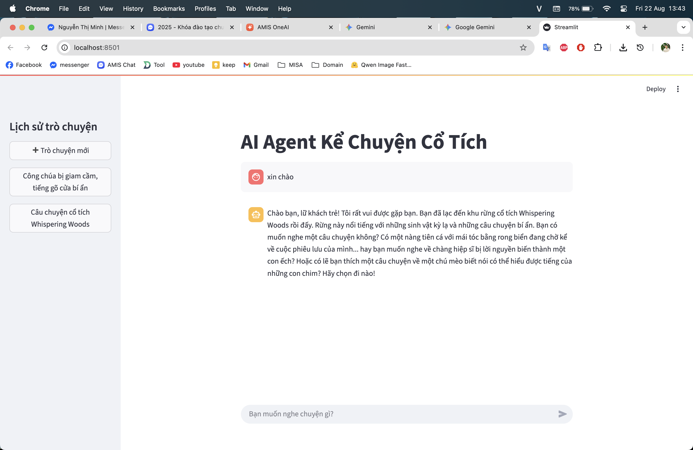
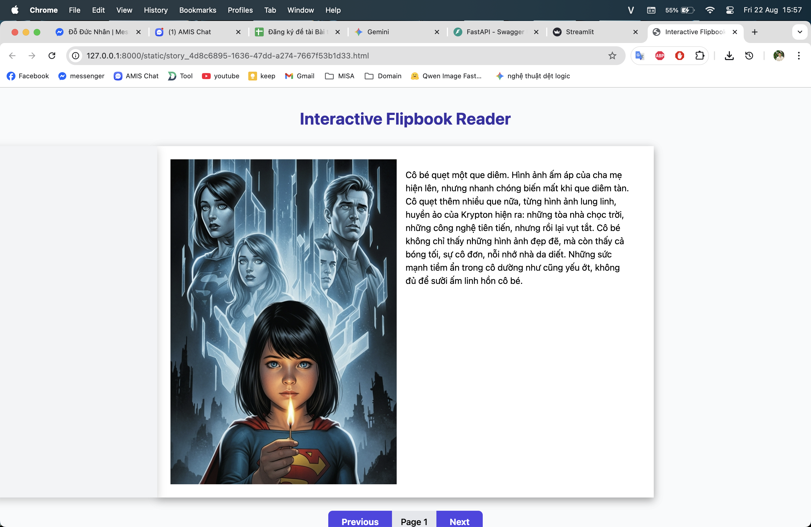

Ứng dụng tạo truyện cổ tích bằng AI Agent dựa trên langraph





install package python

```
python3.11 -m venv venv
source venv/bin/activate
pip install --upgrade pip setuptools wheel
pip install -r requirements.txt
```

start mongodb

```
brew services start mongodb/brew/mongodb-community@8.0
```

stop mongodb

```
brew services stop mongodb-community@8.0
```

server mongodb

```
192.168.0.160:27017
schema ai_agent
```
